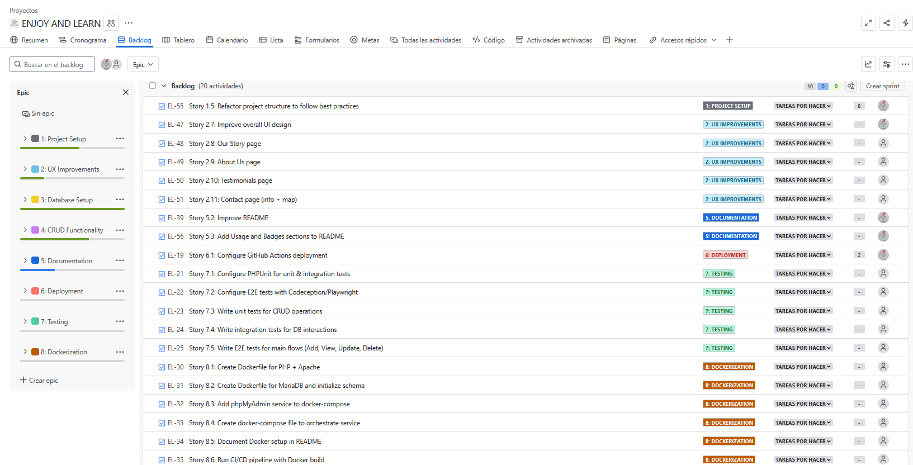
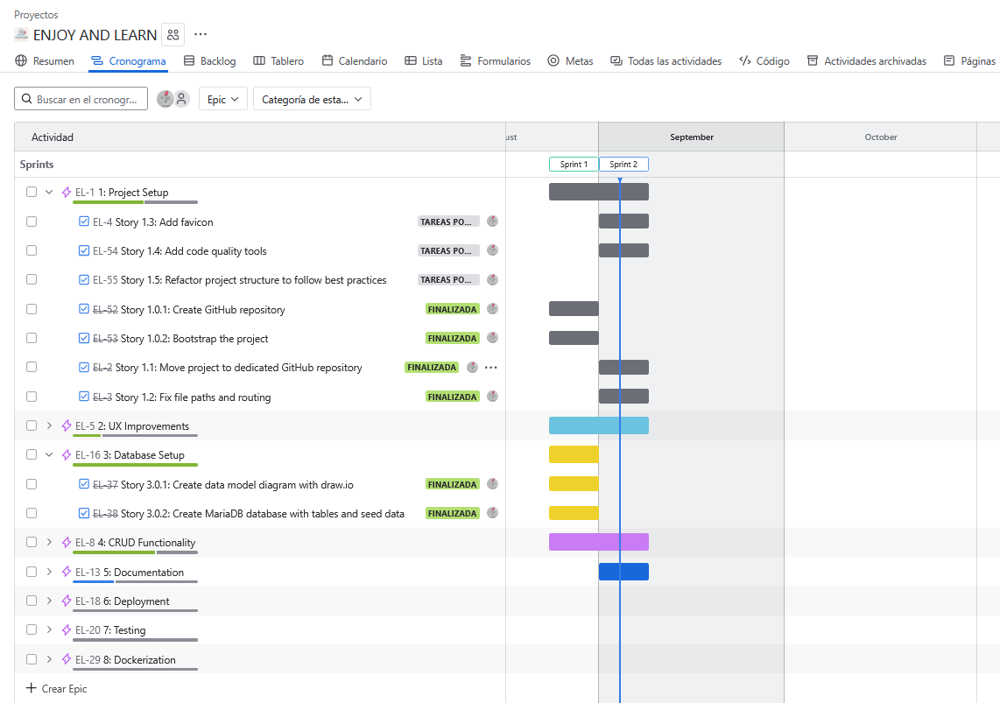
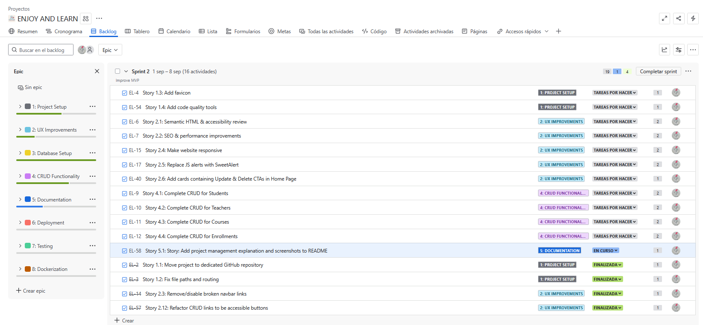
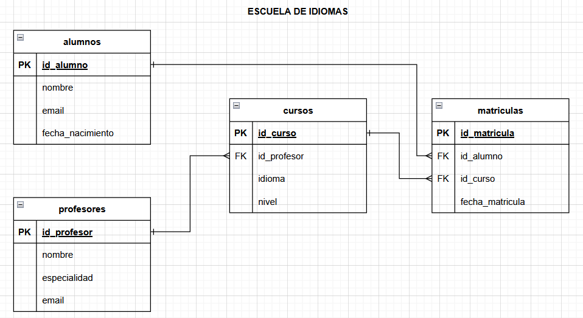

# ❤️🇫🇷🇬🇧 Enjoy & Learn: *Making language learning a joyful adventure*

---

## 📖 Description

**Enjoy & Learn** is a playful and intuitive web application designed to support the management of a children's language academy. Focused on creating a fun and enriching learning environment, this tool simplifies administrative tasks so educators can focus on what matters most: **helping kids enjoy learning English and French**.

Whether you're managing students, teachers, courses or enrollments, this app gives you full control over the essential data of your academy — all in one place.

## 🌟 Philosophy

At **Enjoy & Learn**, we believe language learning should be
🎵 *engaging and fun*,
💡 *curiosity-driven*, and
🌱 *full of meaningful connections*.

This app is built to support that mission — with structure, clarity, and heart.

## 👥 Features

* 🧒 **Add, view, update, and delete students**
* 👩‍🏫 **Manage teacher records** with ease
* 📚 **Create and organize language courses**
* 📝 **Handle course enrollments** efficiently

## 📋 Project Management

This project is managed following **Agile methodologies**, with detailed [Jira](https://www.atlassian.com/software/jira?referer=jira.com) tickets that are properly grouped under their corresponding **epics**.  

Each ticket includes:

* A clear **description**  
* A well-defined **user story**  
* Explicit **acceptance criteria**  

The workflow is organized into a backlog, timeline, and active sprints.  
To illustrate the process, this repository includes screenshots of:

* The **backlog**:
  


* The **timeline**:



* The **current sprint**:



* An example of a **detailed ticket**:


## 🗂️ Data Model Diagram

Here you can see the ER Diagram:



## 🛠️ Tech stack

* 🎨 **Frontend**: HTML, CSS, PHP  
* 🧑‍💻 **Backend**: PHP, MariaDB/MySQL  
* 🗄️ **Tools**: XAMPP, phpMyAdmin, Docker (future)  
* 🧪 **Testing**: PHPUnit, Playwright
* 🚀 **Deployment**: DigitalOcean Droplet (LAMP stack)

## ⚙️ Installation Guide

### ✅ Prerequisites

* Install [XAMPP](https://www.apachefriends.org/) (ensure **Apache** and **MySQL** are running).
* Make sure your `htdocs` directory is accessible (default on Windows: `C:\xampp\htdocs\`).

### 📥 Steps

1. Clone this repository (ideally inside `htdocs`):

   ```bash
   cd C:\xampp\htdocs\
   git clone https://github.com/KalypsoDev/enjoyAndLearnVanilla.git
    ```

2. Start **Apache** and **MySQL** from the XAMPP Control Panel.

3. Import the database:

   * Open [phpMyAdmin](http://localhost/phpmyadmin)
   * Create a new database (e.g., enjoyandlearn)
   * Import the file `documents/escuela_idiomas.sql`.

4. Open your browser at [localhost](http://localhost/enjoyAndLearnVanilla/index.html)

5. You are now ready to start editing this project and see your changes update in real time in your web browser.

## 🗺️ Roadmap

Planned improvements for the project include:

* 🐳 **Docker setup** for easier deployment and environment management  
* 🔐 **Authentication system** with login/logout  
* 👥 **Role-based access control** (admin, teacher, student)  
* 🎨 **Improved UI/UX** with TailwindCSS or Bootstrap
* 🌍 **Multilingual support** (EN/FR/ES interface)  

## 📄 License

This project is licensed under the terms of the MIT license. You can use, copy, modify, and distribute the code freely, as long as you acknowledge the original authorship.
